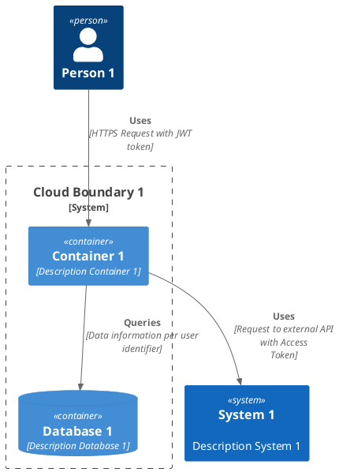

# C4 & Plantuml


<div class="ox-hugo-toc toc has-section-numbers">

<div class="heading">Table of Contents</div>

- <span class="section-num">1</span> [Stop drawing, Start coding](#stop-drawing-start-coding)
- <span class="section-num">2</span> [Threat modeling and beyond](#threat-modeling-and-beyond)
- <span class="section-num">3</span> [REFERENCE:](#reference)

</div>
<!--endtoc-->


本文为摘录，原文为： https://medium.com/flat-pack-tech/threat-modeling-as-code-f3555f5d9024

这个图解释了它为什么叫 C4:

<a id="figure--fig:images-C4"></a>




## <span class="section-num">1</span> Stop drawing, Start coding {#stop-drawing-start-coding}



<a id="figure--fig:simple-c4"></a>



In this example, we have used C4 Container level with the following entities:

-   Person: Developers, end-users or attackers.
-   System: External platforms.
-   System Boundary: Cloud environments.
-   Container: Our backend/frontend application.
-   ContainerDb: Databases.


## <span class="section-num">2</span> Threat modeling and beyond {#threat-modeling-and-beyond}

```plantuml
@startuml
!include <C4/C4_Container.puml>
!include iuml_files/stride.puml

Person(person1, "Person 1","")

System(system1, System 1, "Description System 1")
System_Boundary(bounday1, "Cloud Boundary 1") {
        Container(container1, Container 1, "Description Container 1")
        ContainerDb(database1, $Stride("RI")\n===Database 1, "Description Database 1")
        }

        Rel(person1, container1, $AggregatedRisk("R1") Uses, "HTTPS Request with JWT token")
        Rel(container1, system1, $AggregatedRisk("R2") Uses, "Request to external API with Access Token")
        Rel(container1, database1, "Queries", "Data information per user identifier")

        $RiskTable() [
        === Aggregated Risks
        ----
        $AggregatedRisk("R1") Details of aggregated risk number 1.
        ----
        $AggregatedRisk("R2") Details of aggregated risk number 2
        ]

 @enduml
```

<a id="figure--fig:stride-model"></a>



通过这种方法，我们正在将信任边界从经典的威胁建模扩展到任何类型的系统表示。
然而，我们并没有提供一种清晰的方法来表示模型中每个组件的信任和价值，因此我们需要创建一个信任:价值比率。

-   **信任** 是一个信心、完整性和可用性的评分模式，范围从 1 到 5，但下限和上限可以由您定义。
    例如，外围可能是 1，DMZ 也许是 3，而后端服务是 5。

-   **价值** 表示一种确定敏感数据在存储、转发和处理方面重要性的方法。 您的评分模式的边界应与信任比率中的边界相同。

<!--listend-->

```plantuml
@startuml
!include <C4/C4_Container.puml>
!include iuml_files/stride.puml

Person(person1, "Person 1","")

System(system1, <size:5>$TrustValueRatio("1:3")\n===System 1, "Description System 1")
System_Boundary(bounday1, "Cloud Boundary 1") {
    Container(container1, <size:5>$TrustValueRatio("2:5")\n===Container 1, "Description Container 1")
    ContainerDb(database1, <size:5>$TrustValueRatio("2:5")\n$Stride("RI")\n===Database 1, "Description Database 1")
}

Rel(person1, container1, $AggregatedRisk("R1") Uses, "HTTPS Request with JWT token")
Rel(container1, system1, $AggregatedRisk("R2") Uses, "Request to external API with Access Token")
Rel(container1, database1, "Queries", "Data information per user identifier")

$RiskTable() [
=== Aggregated Risks
----
$AggregatedRisk("R1") Details of aggregated risk number 1.
----
$AggregatedRisk("R2") Details of aggregated risk number 2
]

@enduml
```

<a id="figure--fig:stride-with-trust-value"></a>




## <span class="section-num">3</span> REFERENCE: {#reference}

-   <https://www.oreilly.com/library/view/threat-modeling/9781492056546/ch04.html>

