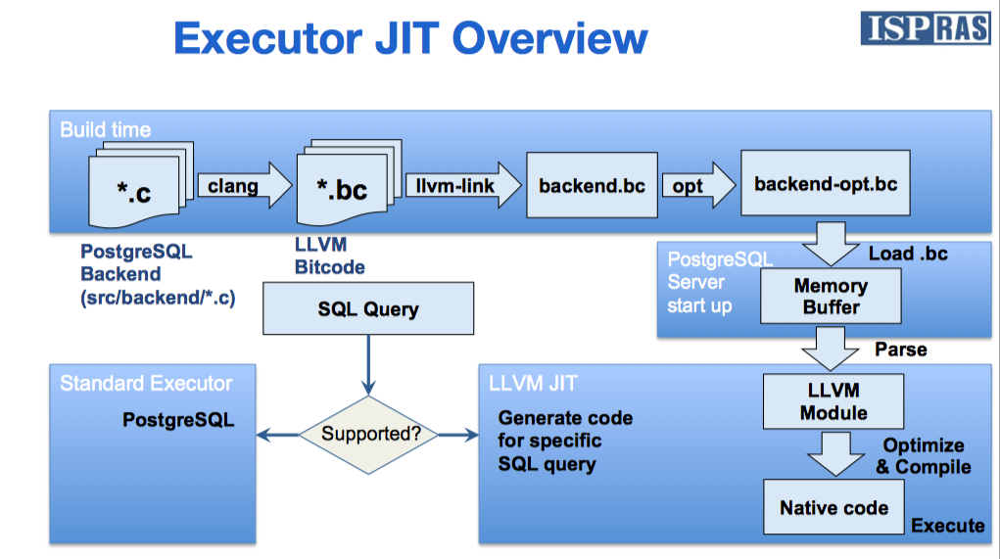

#+TITLE: JIT in Postgres
#+AUTHOR: Yang,Ying-chao
#+EMAIL:  yangyingchao@gmail.com
#+OPTIONS:    ^:nil H:7 num:t toc:2 \n:nil ::t |:t -:t f:t *:t tex:t d:(HIDE) tags:not-in-toc
#+OPTIONS: toc:2
#+STARTUP:    align nodlcheck oddeven lognotestate
#+SEQ_TODO:   TODO(t) INPROGRESS(i) WAITING(w@) | DONE(d) CANCELED(c@)
#+TAGS:       Write(w) Update(u) Fix(f) Check(c) noexport(n)
#+LANGUAGE:   en
#+EXCLUDE_TAGS: noexport
#+KEYWORDS: jit
#+CATEGORY: Database
#+DESCRIPTION: (nil)
#+HTML_HEAD: 

* 简单总结
:PROPERTIES:
:CUSTOM_ID: h:9BFCB4ED-E3D3-4187-864E-54AF021FD7DD
:END:
- backend 目录中所有文件都通过 =clang -emit-llvm= 编译输出 LLVM 形态的中间文件，用于后期 JIT 调用。
- JIT 代码生成，就是运行期，生成代码、将之前的中间文件组织起来，再进行内联、优化，输出可执行代二进制机器码。
- PG 中可以用到的优化方式包括：
  - 内联
  - LLVM 中的各种 pass

*  Overview
:PROPERTIES:
:CUSTOM_ID: h:3C8468CD-3667-42FA-95F2-B54658CC6F44
:END:

* Callflow
:PROPERTIES:
:CUSTOM_ID: h:8C3B7B4F-16A1-431A-A129-2EC74833B8B7
:END:
#+BEGIN_SRC plantuml :file ../assets/img/jit-callflow-gen.png
  |execExpr.c|
  :jit_compile_expr(state);
  |jit.c|
  #00ffff:BEGIN - jit_compile_expr();
  :provider_init();
  :llvm_compile_expr();
  |llvmjit_expr.c|
  #a52a2a:BEGIN - llvm_compile_expr();
  :llvm_create_context();
  :create llvm Module;
  note right
  XXX?
  end note
  :create Instruction Builder;
  :create unique name: _balabala_evelexpr;
  :Do Create Function;
  #a52a2a:END - llvm_compile_expr();
  |jit.c|

  #00ffff:END - jit_compile_expr();
  |execExpr.c|
#+END_SRC
#+CAPTION: JIT call flow
#+NAME: fig:JIT_call_flow
#+RESULTS:
[[file:../assets/img/jit-callflow-gen.png]]

* LLVM Jit Context
:PROPERTIES:
:CUSTOM_ID: h:0BAD3076-AEDA-469A-9A23-D169C69119FB
:END:
=llvm_session_initialize()=

#+BEGIN_SRC plantuml :file ../assets/img/llvm_session_init-gen.png
  |llvm_session_initialize|

  #a52a2a:BEGIN - llvm_session_initialize();

  :LLVMInitializeNativeTarget();
  :LLVMInitializeNativeAsmPrinter();
  :LLVMInitializeNativeAsmParser();

  :llvm_create_types();
  |llvm_create_types|
  :load "llvmjit_types.bc";
  :parse and retrive pre-defined TYPEs;

  |llvm_session_initialize|
  :parse TARGET from triple;
  :parse CPU/Feature;
  :create TargetMachine instance;
  #a52a2a:END - llvm_session_initialize();
#+END_SRC
#+CAPTION: llvm session init
#+NAME: fig:llvm_session_init
#+RESULTS:
[[./images/llvm_session_init-gen.png]]

** llvmjit types
:PROPERTIES:
:CUSTOM_ID: h:9A1031A6-BAEE-41C6-A4F2-94F42C98964C
:END:

#+BEGIN_QUOTE
To be able to generate code that can perform tasks done by "interpreted"
PostgreSQL, it obviously is required that code generation knows about at
least a few PostgreSQL types.  While it is possible to inform LLVM about
type definitions by recreating them manually in C code, that is failure
prone and labor intensive.

Instead there is one small file (llvmjit_types.c) which references each of
the types required for JITing. That file is translated to bitcode at
compile time, and loaded when LLVM is initialized in a backend.

#+END_QUOTE

*** =llvmjit_types.bc=
:PROPERTIES:
:CUSTOM_ID: h:0874C826-92EF-4D9D-82E5-305595E7B176
:END:

Makefile:

  #+BEGIN_SRC makefile -r
    ##########################################################################
    #
    # LLVM support
    #

    ifndef COMPILE.c.bc
    # -Wno-ignored-attributes added so gnu_printf doesn't trigger
    # warnings, when the main binary is compiled with C.
    COMPILE.c.bc = $(CLANG) -Wno-ignored-attributes $(BITCODE_CFLAGS) $(CPPFLAGS) -flto=thin -emit-llvm -c
    endif

    ifndef COMPILE.cxx.bc
    COMPILE.cxx.bc = $(CLANG) -xc++ -Wno-ignored-attributes $(BITCODE_CXXFLAGS) $(CPPFLAGS) -flto=thin -emit-llvm -c
    endif

    %.bc : %.c
    $(COMPILE.c.bc) -o $@ $<

    %.bc : %.cpp
    $(COMPILE.cxx.bc) -o $@ $<
  #+END_SRC

  In compile stage, it becomes:

  #+BEGIN_SRC text -r
  /usr/local/opt/llvm/bin/clang -Wno-ignored-attributes -fno-strict-aliasing -fwrapv -O2  -D__STDC_LIMIT_MACROS -D__STDC_FORMAT_MACROS -D__STDC_CONSTANT_MACROS -I/usr/local/Cellar/llvm/7.0.1/include  -I../../../../src/include   -flto=thin -emit-llvm -c -o llvmjit_types.bc llvmjit_types.c
  #+END_SRC

* Do Create Function
:PROPERTIES:
:CUSTOM_ID: h:D83ECC2B-CC8D-4857-A5C1-FA2D6ACCCF60
:END:

核心思想是将 =ExprState= 中的 Steps 编译生成一个新函数，其签名和作用与下面的函数相同：

#+BEGIN_SRC c++ -r
  static Datum
  ExecInterpExpr(ExprState *state, ExprContext *econtext, bool *isnull);

#+END_SRC

=ExprState= 类图：

#+BEGIN_SRC plantuml :file ../assets/img/exprstate-gen.png

  class ExprState {
      + Node tag
      + uint8 flags
      + bool resnull
      + Datum resvalue
      + TupleTableSlot* resultslot
      + ExprEvalStep* steps
      + ExprStateEvalFunc evalfunc
      + Expr* expr
  }

  class ExprEvalStep {
      + intptr_t opcode
      + Datum* resvalue
      + bool* resnull
      +  d
  }

  ExprState o-- ExprEvalStep
#+END_SRC
#+CAPTION: ExprState
#+NAME: fig:ExprState
#+RESULTS:
[[file:../assets/img/exprstate-gen.png]]

步骤如下：

#+BEGIN_SRC plantuml :file ../assets/img/do-create-function-gen.png
  |do_compile|
  :prepare function;
  |prepare|

  :create Signature & Function;
  :add function to module;
  :copy & set Function Attribute;

  :append "entry";
  :extract addresses of variables\nfrom estate & context;

  |do_compile|

  while(has\nnext step) is (True)
  :get step;
  :get opcode, valuep, nullp;
  :check opcode;
  if (DONE) then (YES)
  :load tmp_value;
  :load tmp_null;
  :cast tmp_null to bool;
  :store bool;
  :create RET;
  elseif (FETCHSOME) then (YES)
  :TODO: details;
  if (can create\njit_deform) then (YES)
  :slot_compile_deform();
  endif

  if (l_jit_deform) then (YES)
  :build ins: call l_jit_deform;
  else (NO)
  :build ins: call FuncSlotGetsomeattrsInt;
  endif

  elseif (VAR) then (YES)
  :assign values & nulls;
  :add ins: load value;
  :add ins: load null;
  :add ins: store value;
  :add ins: store null;

  elseif (SYSVAR) then (YES)
  :prepare parameters;
  :add ins: call FuncExecEvalSysVar;
  elseif (...) then (YES)
  :ACTIVITY;

  else (VALUE2)
  :ACTIVITY;
  endif
  endwhile(False)

  :compile module;
  |comile module|
  #00ffff:BEGIN - inline;
  :do inline;
  #00ffff:END - inline;

  #8a2be2:BEGIN - dump;
  :do dump;
  #8a2be2:END - dump;

  #dc143c:BEGIN - optimize;
  :do optimize;
  #dc143c:END - optimize;
  |do_compile|
#+END_SRC
#+CAPTION: Do Create Function
#+NAME: fig:Do_Create_Function
#+RESULTS:
[[file:../assets/img/do-create-function-gen.png]]

* Inline
:PROPERTIES:
:CUSTOM_ID: h:8BE75A6B-840E-4755-9AA5-819B047359FA
:END:

减少函数调用开销。

#+BEGIN_SRC plantuml :file ../assets/img/inline-gen.png
  |llvm_inline|

  start
  :llvm_build_inline_plan();
  |build_inline_plan|
  :add bitcode to search path;
  :gather function name states;
      while(WorkList \n  empty?) is (NO)
      :pop_back function;
      :parse symbol to mod_name & func_name;

      :update bitcode search path\n  based on mod_name;

      partition "Hanle References" {
          while(function has\n definitions) is (True)
          :get next definitions (defun);
          if (defun can be\n    inlined?) then (NO)
          :add to globalsToInline;
          :break;
      else (YES)
      endif

      endwhile(False)
  }

  endwhile(YES)

  |llvm_inline|
  :llvm_execute_inline_plan;
  |execute_inline_plan|
  while(modules to\n  inline?) is (True)
  :get mod_path;

  while(var in module) is (True)
  :get var (function);
  :get value from module based on name;

  if (is Function ?) then (YES)
  :cast value to Function type;
  :strip debug info;
  :create wraper if necessary;
  :update linkage type;
  endif

  :add to GlobalsToImport;

  endwhile(False)

  :move GlobalsToImport into mod;

  endwhile(False)
  :return;
  |llvm_inline|
  stop
#+END_SRC
#+CAPTION: Inline
#+NAME: fig:Inline
#+RESULTS:
[[file:../assets/img/inline-gen.png]]

** llvm_build_inline_plan
:PROPERTIES:
:CUSTOM_ID: h:420D8D3D-9511-430D-ABAC-9DB5ED54414D
:END:

收集表达式中用到的函数，检查这些函数是否可以用来内联，如果是的话则将其定义和依
赖放进 =globalsToInline= 中。

** llvm_execute_inline_plan
:PROPERTIES:
:CUSTOM_ID: h:1E526F9D-D5D7-4F72-AB3E-903C58408FF6
:END:

Perform the actual inlining of external functions (and their dependencies) into mod.

将之前收集的模块和函数及其依赖，插入到 mod 中。

** 疑问
:PROPERTIES:
:CUSTOM_ID: h:EE54C8DC-9037-4A95-9D69-4F68F56E2270
:END:
为什么还需有手动做这个事情呢？不是应该在优化阶段自动进行吗？

* Optimize
:PROPERTIES:
:CUSTOM_ID: h:6BDBE2E0-7256-440B-950A-7B04F829C5C2
:END:

Optimize code in module using the flags set in context.

#+BEGIN_SRC plantuml :file ../assets/img/llvm-optimization-gen.png
  |llvm_optimize_module|

  start

  :decide optimize level;
  :create PassManagerBuilder (pmb);

  :create FunctionPasssManager (fpm);

  if (opt_level == 3) then (YES)
  :create Inliner pass to pmb;
  else (NO)
  :create PromoteMemoryToRegister pass to fpm;
  endif

  partition "function level optimization" {
  :fill fpm with help of pmb;
  |PassManagerBuilder|
  #00ffff:BEGIN - PassManagerBuilder::populateFunctionPassManager();
  :add extension: EarlyAsPossible;
  :add EntryExitInstrumenter Pass;

  if (has libraryInfo) then (YES)
  :add TargetLibraryInfoWrapper Pass;
  else(NO)
  endif

  if (opt_level > 0) then (YES)
  :add InitialAliasAnalysis passes;
  :add CFGSimplification pass;
  note right
  CFGSimplification - Merge basic blocks, eliminate unreachable blocks,
  simplify terminator instructions, convert switches to lookup tables, etc.
  end note
  :add SROA pass;
  note right
  SROA - Replace aggregates or pieces of aggregates with scalar SSA values.
  end note

  :add EarlyCSE pass;
  note right
  EarlyCSE - This pass performs a simple and fast CSE pass over the dominator
  end note

  :add LowerExpectIntrinsics pass;
  note right
  LowerExpectIntrinsics - Removes llvm.expect intrinsics and creates
  "block_weights" metadata.
  end note

  else(NO)
  endif

  #00ffff:END - PassManagerBuilder::populateFunctionPassManager();

  |llvm_optimize_module|

  :Initialize fpm;
  while(module has\n function?) is (YES)
  :get first function from module;
  :execute passes for function;
  endwhile(NO)
  :finalize fpm;
  :dispose fpm;
  }

  partition "module level optimization" {
  :create new PassManager (mpm);
  :fill mpm with help of pmb;

  |PassManagerBuilder|
  #8a2be2:BEGIN - PassManagerBuilder::populateModulePassManager();
  :add different kinds of passes;
  #8a2be2:END - PassManagerBuilder::populateModulePassManager();
  |llvm_optimize_module|
  :ensure inline pass is added;
  :run PassManager mpm;
  :dispose mpm;
  }

  :dispose pmb;

  stop
#+END_SRC
#+CAPTION: Optimization
#+NAME: fig:Optimization
#+RESULTS:
[[file:../assets/img/llvm-optimization-gen.png]]

* LLVM 知识点
:PROPERTIES:
:CUSTOM_ID: h:330423FA-BFE2-4454-AC09-22F0DFCD7A40
:END:
** Target Triple
:PROPERTIES:
:CUSTOM_ID: h:F2E36CE1-1A36-4373-96DA-DC46911D5E7B
:END:

A module may specify a =target triple string= that describes the target host. The syntax for the
target triple is simply:

#+BEGIN_SRC conf -r
target triple = "x86_64-apple-macosx10.7.0"
#+END_SRC

The target triple string consists of a series of identifiers delimited by the minus sign character
(=-=). The canonical forms are:

#+BEGIN_SRC conf -r
ARCHITECTURE-VENDOR-OPERATING_SYSTEM
ARCHITECTURE-VENDOR-OPERATING_SYSTEM-ENVIRONMENT
#+END_SRC

This information is passed along to the backend so that it generates code for the proper
architecture. It’s possible to override this on the command line with the -mtriple command line
option.

** Data Layout
:PROPERTIES:
:CUSTOM_ID: h:2E0A009A-129B-4E1F-BDDA-313D756AC128
:END:

A module may specify a target specific data layout string that specifies how data is to be laid
out in memory. The syntax for the data layout is simply:

#+BEGIN_SRC text -r
target datalayout = "layout specification"
#+END_SRC

The layout specification consists of a list of specifications separated by the minus sign
character (‘-‘). Each specification starts with a letter and may include other information after
the letter to define some aspect of the data layout.

** =br= Instruction
:PROPERTIES:
:CUSTOM_ID: h:C43749AC-A3FA-4423-8185-20A09A15FA0F
:END:

编译过程中用到了 =LLVMBuildBr(b, opblocks[0]);= ：该函数用于增加 =br= 指令。

*** Syntax:
:PROPERTIES:
:CUSTOM_ID: h:F661FFCC-4464-40CC-B5E1-CAC26CDAA977
:END:

#+BEGIN_SRC asm -r
br i1 <cond>, label <iftrue>, label <iffalse>
br label <dest>          ; Unconditional branch
#+END_SRC

*** Overview:
:PROPERTIES:
:CUSTOM_ID: h:94962F22-F3C6-4A8E-B8CF-5403703D25BE
:END:

The =br= instruction is used to cause control flow to transfer to a different basic block in the
current function. There are two forms of this instruction, corresponding to a conditional branch
and an unconditional branch.

*** Arguments:
:PROPERTIES:
:CUSTOM_ID: h:A5B9D2CB-8A90-48C1-8E86-496E61625C38
:END:

- The conditional branch form of the =br= instruction takes a single =i1= value and two =label= values.
- The unconditional form of the =br= instruction takes a single =label= value as a target.

*** Semantics:
:PROPERTIES:
:CUSTOM_ID: h:1D7B21AC-9A87-481F-B44C-1D23FB7A6611
:END:

Upon execution of a conditional ‘br’ instruction, the ‘i1’ argument is evaluated. If the value
is true, control flows to the ‘iftrue’ label argument. If “cond” is false, control flows to
the ‘iffalse’ label argument.

*** Example:
:PROPERTIES:
:CUSTOM_ID: h:A5D5604A-B0FB-4CC6-A48F-152643FFBEC9
:END:

#+BEGIN_SRC llvm -r
  Test:
    %cond = icmp eq i32 %a, %b
    br i1 %cond, label %IfEqual, label %IfUnequal
  IfEqual:
    ret i32 1
  IfUnequal:
    ret i32 0

#+END_SRC

** Function Attributes
:PROPERTIES:
:CUSTOM_ID: h:7908A15B-7848-428D-8C27-0F4F2FB41A99
:END:

Function attributes are set to communicate additional information about a function. Function
attributes are considered to be part of the function, not of the function type, so functions with
different function attributes can have the same function type.

Function attributes are simple keywords that follow the type specified. If multiple attributes are
needed, they are space separated. For example:

#+BEGIN_SRC llvm -r
define void @f() noinline { ... }
define void @f() alwaysinline { ... }
define void @f() alwaysinline optsize { ... }
define void @f() optsize { ... }

#+END_SRC

** Module Structure
:PROPERTIES:
:CUSTOM_ID: h:F7252509-251D-4D61-A03D-2C7E814C647C
:END:

LLVM programs are composed of Module’s, each of which is a translation unit
of the input programs. Each module consists of functions, global variables,
and symbol table entries. Modules may be combined together with the LLVM
linker, which merges function (and global variable) definitions, resolves
forward declarations, and merges symbol table entries. Here is an example of
the “hello world” module:

#+BEGIN_SRC llvm -r

; Declare the string constant as a global constant.
@.str = private unnamed_addr constant [13 x i8] c"hello world\0A\00"

; External declaration of the puts function
declare i32 @puts(i8* nocapture) nounwind

; Definition of main function
define i32 @main() {   ; i32()*
  ; Convert [13 x i8]* to i8*...
  %cast210 = getelementptr [13 x i8], [13 x i8]* @.str, i64 0, i64 0

  ; Call puts function to write out the string to stdout.
  call i32 @puts(i8* %cast210)
  ret i32 0
}

; Named metadata
!0 = !{i32 42, null, !"string"}
!foo = !{!0}

#+END_SRC

This example is made up of a global variable named “.str”, an external declaration of the “puts” function, a function definition for “main” and named metadata “foo”.

In general, a module is made up of a list of global values (where both functions and global variables are global values). Global values are represented by a pointer to a memory location (in this case, a pointer to an array of char, and a pointer to a function), and have one of the following linkage types.

** Passes
:PROPERTIES:
:CUSTOM_ID: h:324042DC-7FF9-4134-B990-8F14B9FCF25B
:END:

This document serves as a high level summary of the optimization features that LLVM
provides. Optimizations are implemented as Passes that traverse some portion of a program to
either collect information or transform the program. The table below divides the passes that LLVM
provides into three categories. Analysis passes compute information that other passes can use or
for debugging or program visualization purposes. Transform passes can use (or invalidate) the
analysis passes. Transform passes all mutate the program in some way. Utility passes provides some
utility but don’t otherwise fit categorization. For example passes to extract functions to
bitcode or write a module to bitcode are neither analysis nor transform passes. The table of
contents above provides a quick summary of each pass and links to the more complete pass
description later in the document.

#+BEGIN_SRC plantuml :file ../assets/img/llvm-pass-managers-gen.png

  class PassManagerBase {
      + void add()
  }

  class PassManager {
      + bool run()
      + int override
      - PassManagerImpl* PM
  }

  class FunctionPassManager {
      + bool run()
      + bool doInitialization()
      + bool doFinalization()
      + int override
      - FunctionPassManagerImpl* FPM
      - Module* M
  }

  PassManagerBase <|-- PassManager
  PassManagerBase <|-- FunctionPassManager

  enum ExtensionPointTy {
      EP_EarlyAsPossible
      EP_ModuleOptimizerEarly
      EP_LoopOptimizerEnd
      EP_ScalarOptimizerLate
      EP_OptimizerLast
      EP_VectorizerStart
      EP_EnabledOnOptLevel0
      EP_Peephole
      EP_LateLoopOptimizations
      EP_CGSCCOptimizerLate
  }

  class PassManagerBuilder {
      + void addExtension()
      - void addExtensionsToPM()
      - void addInitialAliasAnalysisPasses()
      - void addLTOOptimizationPasses()
      - void addLateLTOOptimizationPasses()
      - void addPGOInstrPasses()
      - void addFunctionSimplificationPasses()
      - void addInstructionCombiningPass()
      + void populateFunctionPassManager()
      + void populateModulePassManager()
      + void populateLTOPassManager()
      + void populateThinLTOPassManager()
      + int ExtensionFn
      + unsigned int OptLevel
      + unsigned int SizeLevel
      + TargetLibraryInfoImpl* LibraryInfo
      + Pass* Inliner
      - std::vector<std::pair> Extensions
  }

  PassManagerBuilder *-- Pass

  enum PassManagerType {
      PMT_Unknown
      PMT_ModulePassManager
      PMT_CallGraphPassManager
      PMT_FunctionPassManager
      PMT_LoopPassManager
      PMT_RegionPassManager
      PMT_BasicBlockPassManager
      PMT_Last
  }

  enum PassKind {
      PT_BasicBlock
      PT_Region
      PT_Loop
      PT_Function
      PT_CallGraphSCC
      PT_Module
      PT_PassManager
  }

  class Pass {
      + PassKind getPassKind()
      + StringRef getPassName()
      + AnalysisID getPassID()
      + bool doInitialization()
      + bool doFinalization()
      + void print()
      + void dump()
      + Pass* createPrinterPass()
      + void assignPassManager()
      + void preparePassManager()
      + PassManagerType getPotentialPassManagerType()
      + void setResolver()
      + AnalysisResolver* getResolver()
      + void getAnalysisUsage()
      + void releaseMemory()
      + void* getAdjustedAnalysisPointer()
      + ImmutablePass* getAsImmutablePass()
      + PMDataManager* getAsPMDataManager()
      + void verifyAnalysis()
      + void dumpPassStructure()
      + AnalysisType* getAnalysisIfAvailable()
      + bool mustPreserveAnalysisID()
      + AnalysisType getAnalysis()
      + AnalysisType getAnalysisID()
      + AnalysisResolver* Resolver
      + void* PassID
      + PassKind Kind
  }

  class ModulePass {
      + bool runOnModule()
      # bool skipModule()
      + int override
  }

  Pass <|-- ModulePass
  class ImmutablePass {
      + void initializePass()
      + int override
  }

  ModulePass <|-- ImmutablePass
  class FunctionPass {
      + bool runOnFunction()
      # bool skipFunction()
      + int override
  }

  Pass <|-- FunctionPass
  class BasicBlockPass {
      + bool doInitialization()
      + bool runOnBasicBlock()
      + bool doFinalization()
      # bool skipBasicBlock()
      + int override
      + int llvm::Pass::doInitialization
      + int llvm::Pass::doFinalization
  }

  Pass <|-- BasicBlockPass
#+END_SRC
#+CAPTION: Pass Manager
#+NAME: fig:Pass_Manager
#+RESULTS:
[[file:../assets/img/llvm-pass-managers-gen.png]]

